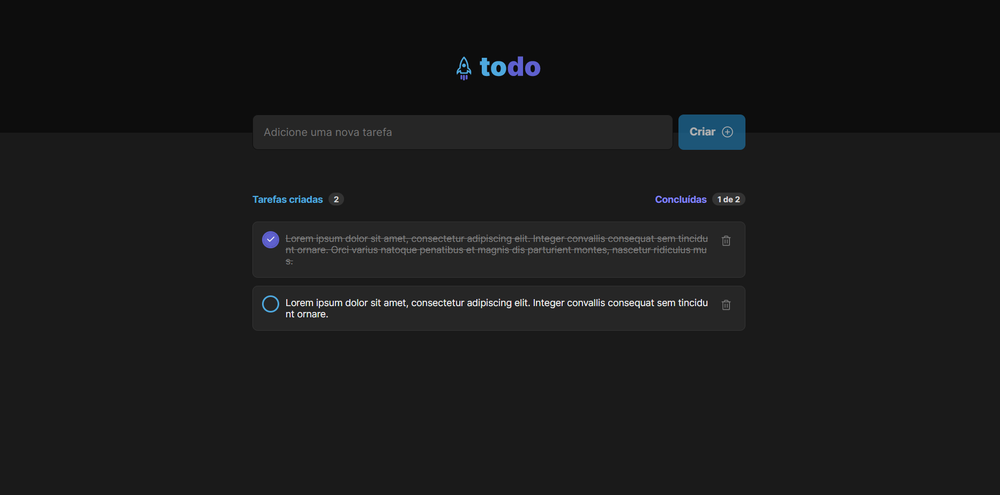
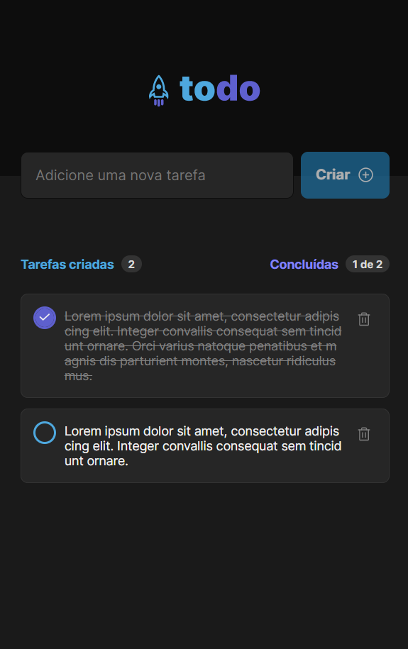

<h1 align="center">ToDo</h1>

O programa Todo foi criado com o intuito de compreender mais sobre os fundamentos do ReactJs como componentes, hooks como o useState e propriedades. O programa foi criado para que usuários possam criar suas tarefas e marcar como concluídas e apagá-las se quiser.

 

# 🚀 Tecnologias

Projeto desenvolvido com as seguintes tecnologias:

- React JS
- TypeScript
- CSS Modules
- Radix UI
- Git e Github
- Figma

 

# ⚙️ Projeto
Você pode acessar o projeto e testá-lo clicando nesse link: [ToDo](https://lukasrib15.gihub.io/to-do)

<br/
>
# 💻 Principais issues

- Criar componentes Header, Search, ListTask, Task
- Tornar a aplicação responsiva
- Criar tarefas
- Mostrar tarefas criadas em tela
- Apagar tarefas
- Configurar a quantidade de tarefas criadas e concluídas
- Validar formulário

 

<h2>Versão Desktop:</h2> 

  

<h2>Versão Mobile:</h2>

